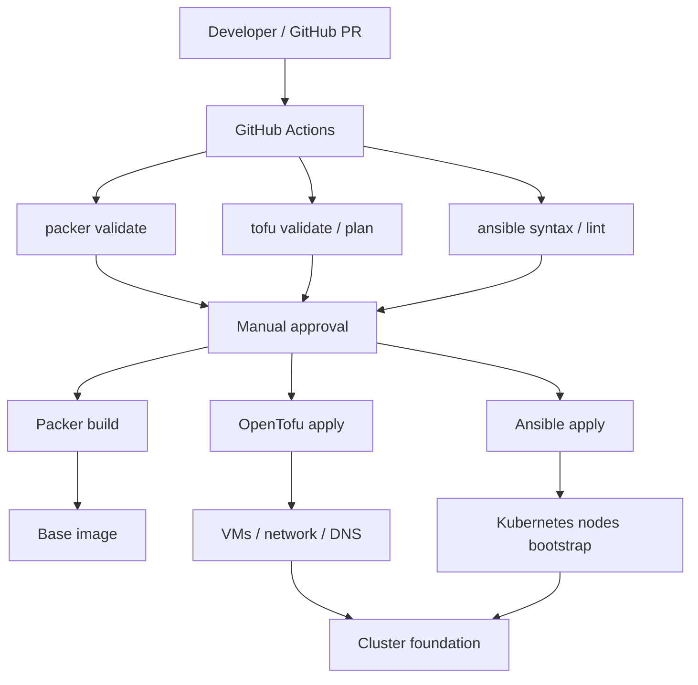

# Platform bootstrap for Kubernetes infrastructure

This repository is a starter project for building a reusable Kubernetes platform on top of a self-hosted and cloud-integrated infrastructure. It focuses on provisioning the base platform layer: operating system image creation, node lifecycle management, cluster bootstrapping, and CI/CD automation.

The project is intentionally designed as a foundation for a broader platform stack that will eventually include:

- Ingress controller
- Secrets management with Vault
- GitOps deployment with Argo CD
- Service mesh with Istio
- Database services running in AWS
- EKS cluster for production and staging apps

This repository is still in its early stages, but it already demonstrates the core idea: infrastructure as code, automated validation, and controlled deployment workflows for Kubernetes environments.

## Why this project exists

The main goal is to create a repeatable platform for provisioning and managing Kubernetes infrastructure with a strong DevOps workflow. The repository is designed to cover the operational foundations before adding platform services such as ingress, policy enforcement, runtime observability, and application delivery automation.

## Current scope

The current implementation includes:

- Packer-based image creation for base OS and bootstrap components
- OpenTofu configuration for VM and network provisioning in a libvirt/KVM environment
- Ansible automation for Kubernetes bootstrap and node configuration
- GitHub Actions workflows for validation and deployment gates
- Manual approval gates for production infrastructure changes

## Planned platform stack

The next evolution of this platform is intended to include the following components:

- Ingress: NGINX or Traefik for external traffic routing
- Vault: centralized secret storage and dynamic secrets
- Argo CD: GitOps-based application delivery
- Kyverno: policy as code
- Grafana + Prometheus + CloudWatch: observability
- Istio: traffic management, service-to-service security, and observability
- AWS-managed data services: RDS, Aurora, ElastiCache, or managed PostgreSQL/MySQL services
- EKS cluster: for release candidates and production workflows


This gives the project a clear path from a bootstrap platform into a production-ready cloud-native platform architecture.

## Architecture



## Repository structure

```text
.
├── .ansible
├── .github
│   └── workflows
│       └── ci.yml
├── ansible/
│   ├── k8s-post.yaml
│   └── templates/
├── bootstrap/
├── inventory.yaml
├── packer/
├── terraform/
├── README.md
└── .gitignore
```

## Current components

### Packer

The Packer configuration builds a base operating system image that contains the required bootstrap dependencies and Kubernetes-related packages. This layer is designed to reduce the amount of drift between machines and make a reusable base image for cluster nodes.

Important design point:

- Base OS and critical bootstrap packages belong here
- Frequently changing Kubernetes config should be managed in Ansible rather than in the image layer
- Image changes should remain controlled and versioned

### OpenTofu

The Terraform/OpenTofu layer defines the infrastructure for the VM hosts and the virtual network. It includes the libvirt network and the machine definitions that form the Kubernetes cluster foundation.

This layer is responsible for:

- VM creation
- networking
- DNS configuration
- storage and image references
- environment-specific infrastructure state

### Ansible

Ansible is used to configure the machines after provisioning. This is the place where cluster-specific settings and operational tuning can be adjusted without rebuilding the base image each time.

Typical responsibilities include:

- Kubernetes installation and upgrade
- service configuration
- bootstrapping of node roles
- cluster-specific customization

### Bootstrap

The bootstrap section is meant for the initial infrastructure that supports the CI/CD workflow itself. It creates the required AWS/S3-based state storage and IAM roles used by the deployment pipeline.

This part is intentionally kept separate from the main CI flow for security reasons.

## CI/CD workflow

The repository includes a GitHub Actions pipeline designed to validate and gate changes before infrastructure is applied.

### Pull request flow

1. Create a feature branch.
2. Make changes to infrastructure or config.
3. Push the branch.
4. Open a pull request against `main`.
5. GitHub Actions validates the platform changes.

Validation steps include:

- Packer syntax validation
- Ansible lint and syntax checks
- OpenTofu validation and plan checks

If validation fails, the workflow blocks further progress.

### Production deployment flow

When changes are merged to `main`, infrastructure changes can be applied through a manually triggered deployment workflow. Deployment actions are protected by environment approvals and are executed in a controlled sequence.

Each production job can also be started independently, which means that a user may run only one of the stages if needed. However, when multiple production jobs are selected together, they run in a strict order:

1. Packer build
2. OpenTofu apply
3. Ansible apply

This ensures infrastructure is changed in a predictable and reviewable order. For example, if a user triggers both Packer and OpenTofu, Packer must complete successfully before OpenTofu starts.

Packer is treated as a more disruptive step because a new base image can require recreation or replacement of the underlying virtual machines. For that reason, it is intended as a last-resort or controlled infrastructure reset operation rather than a routine update path.

## Local validation (optional)

This project is primarily validated through GitHub Actions, but local validation is still useful during development and troubleshooting. It is not required to deploy the platform, but it is helpful for fast feedback before pushing changes.

For local checks, the following commands can be used:

```bash
# Packer validation
cd packer
packer validate -syntax-only .

# OpenTofu validation
cd ../terraform
tofu init
tofu fmt -check
tofu validate
tofu plan

# Ansible validation
cd ../ansible
ansible-playbook --syntax-check k8s-post.yaml
```

## Project status

This repository represents the current foundation of the platform:

- OS image build automation
- infrastructure provisioning for KVM/VM hosts
- Kubernetes bootstrap and node setup
- CI validation gate for PRs
- controlled deployment flow with approvals

The project is still a work in progress, but it already demonstrates a realistic and practical DevOps platform approach.

