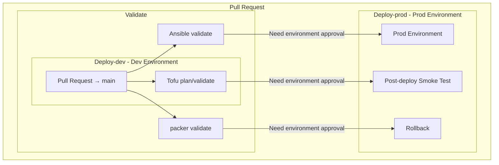

# Description
CI/CD pipeline for create and maitane kubernetes cluster base platform. Complete infrastructure configuration using:
 * **packer** to build OS image with nessesary base components.
 * **terraform** to create machines on kvm, configure network and store infrastructure state on S3.
 * **ansible** for install kubernetes components and initialize nodes.

## Pull Request workflow
<ol>
<li>Create a feature branch.</li>
<li>Make a code change.</li>
<li>Push the branch.</li>
<li>Open a Pull Request against main.</li>
<li>GitHub Actions automatically runs:</li>
<li>tofu plan</li>
<li>ansible validation</li>
<li>packer validation</li>
<li> A failed validation or plan check prevents the pipeline from progressing to prod.</li>
</ol>

## Apply configuration

When changes are merged into `main`, maintaner can manually run pipline on `main` branch. All of the steps that changes the infrastructure (packer, tofu-apply and ansible) need manualy confirmation by one of the reviewers. Each job can be run independently. When several are selected together, they run in a fixed order: Packer, then Tofu, then Ansible.

[TBD] 
A change to the image built by Packer requires creating a release and a tag. The image is named after the tag, and Tofu deploys the image with that tag.

This solves two problems:

1. **Version history:** old image versions are kept, not only the latest one.
2. **Single run:** one run of the pipeline (Packer, Tofu, Ansible) creates the environment with the new image, and the image version doesn't have to be committed to the repository.

## Flow chart

# Use cases

## Packer

The Packer configuration contains the base OS setup, such as GRUB and swap. It is not meant to be changed often, because applying a new image requires recreating the machines.

It also contains some components that need more frequent updates (for example kubelet). They are installed there only for bootstrapping and are overridden in the Ansible section, so updates should be made in Ansible first.

## OpenTofu

This section contains the configuration of the virtual machines and the network. To add or remove machines, edit the `inventory.yaml` file in the root of this repository. Machine resources (CPU, memory) are changed in the same file. Any other changes to the machines are made in the `terraform` directory.

## Ansible

Here you can override the machine configuration without building a new image with Packer, for example to update the Kubernetes version or to add other components.

## Bootstrap

This is the OpenTofu configuration for the CI itself. It creates the S3 bucket and the IAM roles that the pipeline uses in the `tofu plan` and `tofu apply` steps. It is run manually and only once, and it is deliberately not managed by the CI, for security reasons.

